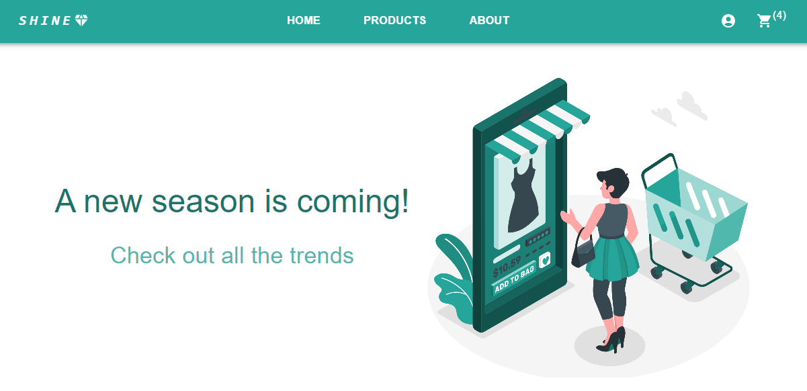
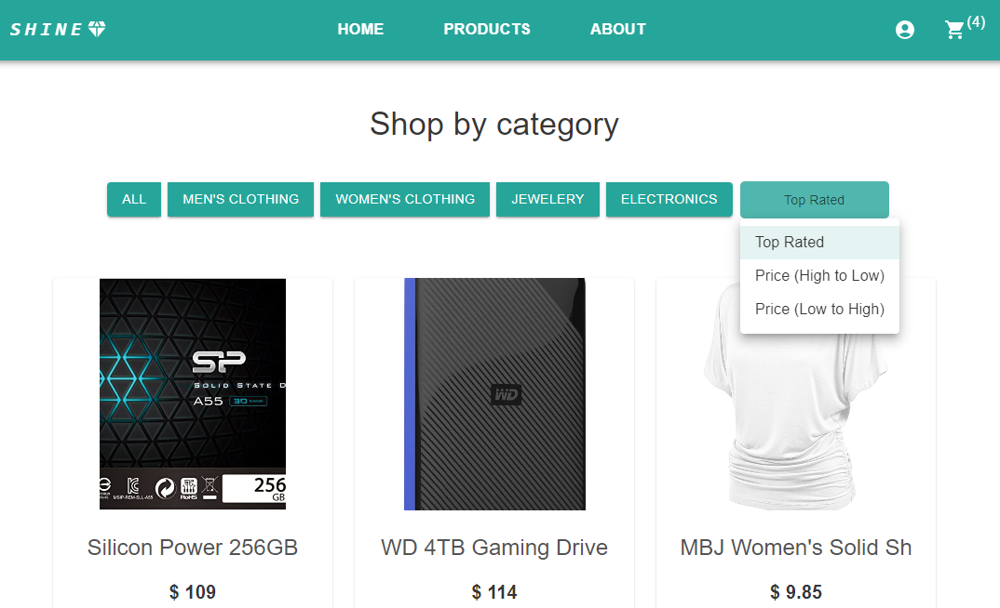
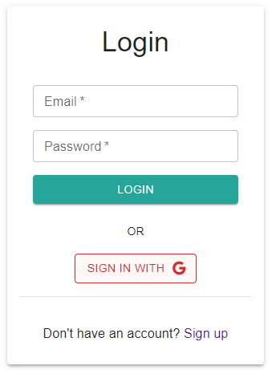
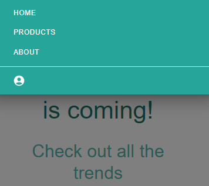

<h1 align="center">E-Commerce App</h1>
<h2 align="center">

</h2>

<h3 align="center">
    <a href="https://e-commerceeeee.netlify.app/" target="_blank">Life Demo</a>
</h3>

### Description

---

An e-commerce application for online shopping using ReactJS and Redux Toolkit with Firebase API. It is a piece of software that allows customers to browse and purchase items from an online store.

The project was created using React and MUI.

### How it works

---

This is a one-page site, and React Router is used to navigate between such pages as:

- Home
- Products
- Cartoons
- Dynamic product page
- Cart
- Account (for authorized users only)
- Login/Register()
- Waiting (stub for all invalid references)

**Here are examples of components:**

_
Products:
_

Filtering products by category and sorting:

- Top Rated(default),
- Price (High to Low),
- Price (Low to High)

_
Login and Register:
_

Authorization and registration - using **Firebase**, authorization and registration methods: (Mail and password), Google authorization.

_
Navbar:
_

The application is also adapted for mobile devices. With **Drawer** MUI, the navigation bar appears on top when you click on the Menu Icon.

### Additionally

---

I've learned myself web development, so if you have any comments, I will be happy to chat with you on social networks (see my <a href="https://github.com/liyakot">profile</a> :fire:)

This project was bootstrapped with [Create React App](https://github.com/facebook/create-react-app), using the [Redux](https://redux.js.org/) and [Redux Toolkit](https://redux-toolkit.js.org/) template.

## Getting Started with Create React App and Redux

### Available Scripts

In the project directory, you can run:

#### `npm start`

Runs the app in the development mode.\
Open [http://localhost:3000](http://localhost:3000) to view it in your browser.

The page will reload when you make changes.\
You may also see any lint errors in the console.

#### `npm test`

Launches the test runner in the interactive watch mode.\
See the section about [running tests](https://facebook.github.io/create-react-app/docs/running-tests) for more information.

#### `npm run build`

Builds the app for production to the `build` folder.\
It correctly bundles React in production mode and optimizes the build for the best performance.

The build is minified and the filenames include the hashes.\
Your app is ready to be deployed!

See the section about [deployment](https://facebook.github.io/create-react-app/docs/deployment) for more information.

#### `npm run eject`

**Note: this is a one-way operation. Once you `eject`, you can't go back!**

If you aren't satisfied with the build tool and configuration choices, you can `eject` at any time. This command will remove the single build dependency from your project.

Instead, it will copy all the configuration files and the transitive dependencies (webpack, Babel, ESLint, etc) right into your project so you have full control over them. All of the commands except `eject` will still work, but they will point to the copied scripts so you can tweak them. At this point you're on your own.

You don't have to ever use `eject`. The curated feature set is suitable for small and middle deployments, and you shouldn't feel obligated to use this feature. However we understand that this tool wouldn't be useful if you couldn't customize it when you are ready for it.

### Learn More

You can learn more in the [Create React App documentation](https://facebook.github.io/create-react-app/docs/getting-started).

To learn React, check out the [React documentation](https://reactjs.org/).
